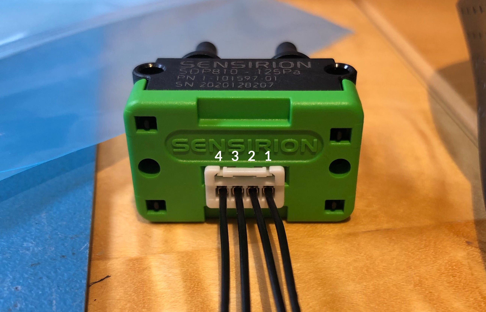
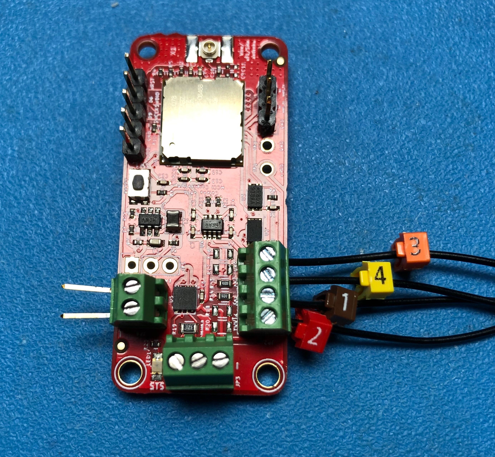

# MCCI Catena&reg; Arduino Library for Sensirion Differential Pressure Sensors

This library provides a simple interface to Sensirion SDP31, SDP32, and SDP800-family differential pressure sensors. Although we tested this on the MCCI Catena 4618, there are no dependencies on MCCI hardware; this should work equally well with Adafruit breakout boards, etc.

See [Meta](#meta) for information on getting sensors from MCCI.

<!-- TOC depthFrom:2 updateOnSave:true -->

- [Installation](#installation)
	- [Installing Manually With Zip](#installing-manually-with-zip)
	- [Installing with the IDE](#installing-with-the-ide)
- [Using the Library](#using-the-library)
	- [Header file](#header-file)
	- [Namespaces](#namespaces)
	- [Declare Sensor Objects](#declare-sensor-objects)
	- [Preparing for use](#preparing-for-use)
	- [Setting measurement mode](#setting-measurement-mode)
	- [Start a measurement](#start-a-measurement)
	- [Poll results](#poll-results)
	- [Read measurement results](#read-measurement-results)
	- [Get most recent data](#get-most-recent-data)
	- [Put sensor to sleep](#put-sensor-to-sleep)
	- [Shutdown sensor (for external power down)](#shutdown-sensor-for-external-power-down)
- [Use with Catena 4801 M301](#use-with-catena-4801-m301)
- [Meta](#meta)
	- [Sensors from MCCI](#sensors-from-mcci)
	- [License](#license)
	- [Support Open Source Hardware and Software](#support-open-source-hardware-and-software)
	- [Trademarks](#trademarks)

<!-- /TOC -->

## Installation

### Installing Manually With Zip

- Download the latest ZIP version from the [release page](https://github.com/mcci-catena/MCCI_Catena_SDP/releases)
- Either unzip manually into your Arduino/Libraries directory, or use the IDE and select `Sketch > Include Library > Add .ZIP Library`.

### Installing with the IDE

- This library is published as an official Arduino library. So you can install from the IDE using `Sketch > Include Library > Manage Libraries...` to open the library manager, then search for `MCCI` and select this library from the list.

## Using the Library

### Header file

```c++
#include <MCCI_Catena_SDP.h>
```

### Namespaces

```c++
using namespace McciCatenaSdp;
```

### Declare Sensor Objects

```c++
// declare an instance of a sensor using TwoWire interface Wire,
// and the specified address. The known addresses are:
//    cSDP::Address::SDP3x_A (0x21, ADDR grounded)
//    cSDP::Address::SDP3x_B (0x22, ADDR to 1.2 kOhm resistor to ground)
//    cSDP::Address::SDP3x_C (0x23, ADDR to 2.7 kOhm resistor to ground)
//    cSDP::Address::SDP8xx  (0x25, only supported address)
// The default for the interface is &Wire, and the default i2c_address is SDP3x_A.

cSDP mySdp(&Wire, i2c_address);
```

You need to declare one `cSDP` instance for each sensor.

### Preparing for use

Use the `begin()` method to prepare for use.

```c++
bool cSDP::begin();
```

It returns `true` for success, `false` for failure.

### Setting measurement mode

The mode can be set by the following commands:

```c++
// cSDP::Mode::DifferentialPressure is the default
// cSDP::Mode::MassFlow selects mass flow optimized measurements.
bool cSDP::setMode(cSDP::Mode mode);
cSDP::Mode cSDP::getMode() const;
```

### Start a measurement

```c++
bool cSDP::startTriggeredMeasurement();
```

V1.0.0 of the library only supports triggered measurements in differential pressure mode. However, it's architected to allow easy addition of continuous measurements in differential pressure or mass flow mode.

### Poll results

```c++
bool cSDP::queryReady();
```

After trigging a measurement, you must delay for it to become available. `queryReady()` will return `true` once a measurement is ready.

To be really safe, if this returns `false` when using this to exit a busy loop, you should check the last error code. If it's not `cSDP::Error::Busy`, then a measurement is not in progress, and the loop will never exit.

### Read measurement results

```c++
bool cSDP::readMeasurmeent();
```

This succeeds only if `queryReady()` has returned true. It reads the measurement from the sensor into internal buffers and returns `true` if all is successful. CRCs are checked.

If it fails, the last data in internal buffers is not changed.

### Get most recent data

```c++
// return temperature in degrees Celsius.
float cSDP::getTemperature() const;
// return differential pressure in Pascals.
float cSDP::getDifferentialPressure() const;
// return Measurement::Temperature and Measurement::DifferentialPressure:
cSDP::Measurement getMeasurement() const;
```

### Put sensor to sleep

```c++
bool cSDP::sleep();
```

This routine issues a sleep command to the sensor. It can only be issued when the sensor is idle, and will return `false` if the sensor is not in the appropriate state. The library will automatically wake up the sensor when appropriate.

### Shutdown sensor (for external power down)

```c++
void cSDP::end();
```

This routine shuts down the library (for example, if you're powering down the sensor). 
You must call `cSDP::begin()` before using the sensor again.

## Use with Catena 4801 M301

The Catena 4801 M301 is a modified Catena 4801, with I2C brought to JP2 (and a LPWAN radio, of course).

The configuration looks like this:

   | 4801 Pin |  Label | SDP Pin     | Cable Tag Color
   |:--------:|:------:|:-----------:|---------------
   |   JP2-1  |  +VDD  |      2      | Red
   |   JP2-2  |   SCL  |      1      | Brown
   |   JP2-3  |   SDA  |      4      | Yellow
   |   JP2-4  |   GND  |      3      | Orange

The cable on the SDP810-125Pa attaches like this:



The wires of the cable assembly should be connected to JP2 of the 4801 M301. Note the interleaving.



See the example sketch, [`examples/sdp_lorawan`](examples/sdp_lorawan/README.md) for a complete example that transmits data via the network.

## Meta

### Sensors from MCCI

MCCI offers a complete test kit, the MCCI Catena 4801 M311, consisting of an SDP810-125Pa sensor, a cable, and an [MCCI Catena 4801](https://mcci.io/catena4801) M301 I2C/Modbus to LoRaWAN board. We also offer accessories and enclosures to help you get started quickly, along with technical support.

If you can't find the Catena 4801 kit on the store, please contact MCCI directly, or ask a question at [portal.mcci.com](https://portal.mcci.com).

### License

This repository is released under the [MIT](./LICENSE) license. Commercial licenses are also available from MCCI Corporation.

### Support Open Source Hardware and Software

MCCI invests time and resources providing this open source code, please support MCCI and open-source hardware by purchasing products from MCCI, Adafruit and other open-source hardware/software vendors!

For information about MCCI's products, please visit [store.mcci.com](https://store.mcci.com/).

### Trademarks

MCCI and MCCI Catena are registered trademarks of MCCI Corporation. All other marks are the property of their respective owners.
